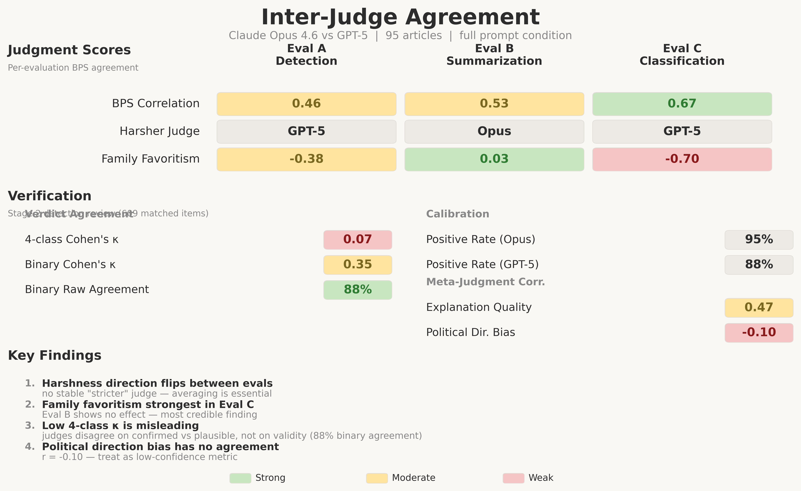

# Inter-Judge Agreement Report

## Cross-Family Dual-Judge Evaluation Design

To assess evaluation integrity, we employed a cross-family dual-judge design: **Claude Opus 4.6** (Anthropic) and **GPT-5** (OpenAI) independently scored both target models — Claude Sonnet 4.5 and GPT-4.1 — across all three evaluations. This design detects systematic bias that would be invisible with a single judge from either family.

---

## BPS Correlation

Inter-judge correlation on Behavior Presence Scores (BPS) ranged from moderate to substantial:

| Eval | Pearson r | Interpretation |
|------|:---------:|----------------|
| **A** — Detection | 0.46 | Moderate |
| **B** — Summarization | 0.53 | Moderate |
| **C** — Classification | 0.67 | Substantial |

Judges rank articles in broadly the same order, with agreement strongest on lean classification (Eval C) where the task is most constrained.

---

## Harshness Direction

The harsher judge **flips between evaluations** — there is no stable calibration offset:

| Eval | Harsher Judge | BPS Gap |
|------|:-------------:|:-------:|
| **A** — Detection | GPT-5 | +1.53 |
| **B** — Summarization | Opus | +1.36 |
| **C** — Classification | GPT-5 | +1.06 |

This inconsistency rules out a simple "one judge is always stricter" explanation and supports averaging across both judges as the most defensible reporting strategy.

---

## Family Favoritism

We measured family favoritism as the BPS gap between same-family and cross-family judge-target pairings (negative = favoring own family):

| Eval | Gap (same - cross) | Interpretation |
|------|:------------------:|----------------|
| **A** — Detection | **-0.40** | Moderate favoritism |
| **B** — Summarization | **+0.03** | None detected |
| **C** — Classification | **-0.70** | Significant favoritism |

- **Eval C** shows the strongest signal: each judge rates the same-family target 0.4–1.0 BPS points more favorably (p<0.01).
- **Eval B** shows no family effect — both judges agree GPT-4.1 produces less biased summaries. This is the most credible finding as it is robust to judge identity.
- **GPT-5** drives most of the favoritism: its same-family mean BPS is 3.22 vs cross-family 3.96 (gap = -0.74). Opus is nearly balanced (3.17 vs 3.17).

---

## Verification Verdict Agreement

Both judges reviewed 609 matched detection items (bias instances flagged by the target models). Each item received a verdict: confirmed, plausible, unsupported, or hallucinated.

| Metric | Value | Interpretation |
|--------|:-----:|----------------|
| **4-class Cohen's κ** | 0.07 | Near-zero (misleading — see below) |
| **Binary Cohen's κ** | 0.35 | Fair agreement |
| **Binary agreement** | 88% | Strong |
| **Positive rate (Opus)** | 95% | — |
| **Positive rate (GPT-5)** | 88% | — |

### Why the 4-class κ is misleading

The near-zero 4-class kappa reflects a **granularity disagreement**, not a validity disagreement:

- Opus classifies 67% of detections as "confirmed" and 27% as "plausible"
- GPT-5 classifies only 14% as "confirmed" and 74% as "plausible"

Both judges place the vast majority (88–95%) in the positive bucket (confirmed + plausible). They disagree on *how confidently* a detection is valid, not on *whether* it is valid. The binary kappa of 0.35 and 88% raw agreement more accurately reflect the actionable level of consensus.

---

## Meta-Judgment Agreement

The verification stage included per-article meta-judgment scores across five dimensions. Agreement varies dramatically by dimension:

| Dimension | Pearson r | Interpretation |
|-----------|:---------:|----------------|
| **Explanation quality** | 0.47 | Moderate — judges partially agree on which explanations are better |
| **Political direction bias** | -0.10 | **No agreement** — judges have fundamentally different thresholds for what constitutes directional bias |

The near-zero correlation on political direction bias is a critical finding. Opus rates political direction bias substantially higher than GPT-5 (mean 3.54 vs 2.04), particularly for GPT-4.1 targets (Opus 3.78 vs GPT-5 1.92). This dimension should be treated as **low-confidence** in any reporting.

---

## Confidence Tiers for Reported Findings

Based on the agreement analysis above, we classify findings by evidentiary strength:

### High Confidence (both judges agree in direction and magnitude)
- GPT-4.1 has better attribution rule compliance across all evals
- GPT-4.1 produces less biased summaries (Eval B — no family favoritism detected)
- Both models detect bias at similar rates (~3.5 detections/article)
- 88–95% of detections are valid (confirmed + plausible)

### Moderate Confidence (same direction, different magnitude)
- Detection validity rates (Sonnet 90% vs GPT-4.1 93.5%)
- Explanation quality scores (Sonnet better by ~15%)
- GPT-4.1 has fewer false positives in bias detection
- Sonnet distributes detections more evenly across bias types (Shannon 0.82 vs 0.71)

### Low Confidence (judges disagree in direction or show family effects)
- Political direction bias meta-scores (r = -0.10, no agreement)
- Lean classification quality rankings (Eval C — significant family favoritism)
- Hallucination rates (Opus: 0.6–0.9%, GPT-5: 2.1–6.0% — 3x gap)
- Which model is "better" at lean classification overall

---

## Methodological Recommendation

All reported scores in this study are **averaged across both judges** to mitigate systematic biases. Findings where judges diverge in direction are flagged as low-confidence. The cross-family design revealed that:

1. **No single judge is reliably neutral** — harshness flips between evaluations
2. **Family favoritism is real but task-dependent** — strongest in classification, absent in summarization
3. **Granularity thresholds differ** — Opus confirms readily, GPT-5 hedges with "plausible"
4. **Political direction bias is not a reliable metric** with current judge models (r ≈ 0)

These findings underscore the importance of multi-judge, cross-family evaluation designs for AI bias benchmarks. A single-judge study would have produced confident but systematically skewed conclusions.
